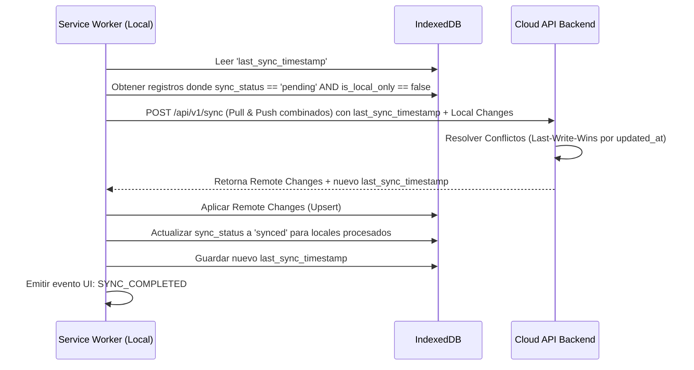

# Arquitectura de Backend

## 1. Visión General y Decisiones Arquitectónicas

La evolución de la extensión de un entorno estrictamente local a un **Ecosistema de Productividad Omnipresente**
requiere una arquitectura híbrida: **Local-First (Offline-First) + Cloud Sync**.

Para garantizar la premisa de "Tranquilidad del Usuario" (Zero-Cognitive Load y offline-first), la base de datos
principal de lectura/escritura seguirá siendo **IndexedDB (Dexie.js)** en el navegador. La sincronización con la nube no
bloqueará la interfaz; operará de manera asíncrona mediante el Service Worker (Background Script) aplicando el patrón *
*Last-Write-Wins (LWW)** basado en marcas de tiempo (`updated_at`) para la resolución de conflictos.

**Decisiones Clave:**

1. **Sincronización Basada en Deltas (Push/Pull):** En lugar de peticiones CRUD individuales por cada cambio, el Service
   Worker acumulará los cambios en estado `pending` y los despachará en bloque (Batch) mediante un único endpoint
   transaccional de sincronización. Esto reduce drásticamente el consumo de red y optimiza la batería.
2. **Versionado Inmutable (Time Machine):** Las iteraciones de un *prompt* no sobrescribirán el historial. Cada edición
   generará un registro inmutable en una nueva colección `profile_versions`, permitiendo el viaje en el tiempo de manera
   determinista tanto online como offline.
3. **Aislamiento por Privacidad (HU-03):** Se introduce una bandera `is_local_only` a nivel de base de datos para
   garantizar de forma estricta que los perfiles creados bajo el modo "Sincronización Pausada" nunca se serialicen hacia
   el backend, previniendo fugas de datos de contexto confidencial.

---

## 2. Esquema de Base de Datos

El sistema maneja dos capas de persistencia: el esquema local (IndexedDB) modificado para soportar estados de red, y el
esquema remoto (PostgreSQL/NoSQL equivalente) para la retención en la nube.

### 2.1. Esquema Local (IndexedDB / Dexie.js v4)

Se extiende la base de datos `ContextOrchestratorDB` introduciendo soporte para versionado y colas de estado.

```javascript
db.version(2).stores({
  // Se añaden índices: sync_status e is_local_only
  profiles: 'id, name, *tags, updated_at, deleted_at, sync_status, is_local_only, usage_count, last_used_at',

  // Nueva tabla para la Máquina del Tiempo (Versionado)
  profile_versions: 'id, profile_id, created_at, sync_status',

  // Red de Seguridad (Intacta, 100% local)
  recovery_history: '++id, timestamp, target_url',

  // Metadatos del sistema (Single-row store)
  app_state: 'key'
});
```

* **Modificaciones a `Profile`:**
  * `sync_status` (Enum: `'synced' | 'pending' | 'error'`): Controla qué registros necesitan enviarse en el próximo
    Push.
  * `is_local_only` (Boolean): Si es `true`, el motor de sincronización ignorará este registro permanentemente (HU-03).
* **Nueva Entidad `ProfileVersion`:**
  * `id` (UUID v4): Identificador de la versión.
  * `profile_id` (UUID v4): Foreign Key lógica al perfil padre.
  * `content_snapshot` (String): El contenido exacto del prompt en ese momento.
  * `version_name` (String | Null): Opcional para nombrar versiones en el futuro.
  * `created_at` (Epoch Integer): Timestamp de la versión.

### 2.2. Esquema Remoto (Nube - Relacional DDL Conceptual)

```sql
CREATE TABLE users
(
  id         UUID PRIMARY KEY,
  email      VARCHAR(255) UNIQUE NOT NULL,
  created_at TIMESTAMP DEFAULT CURRENT_TIMESTAMP
);

CREATE TABLE profiles
(
  id           UUID PRIMARY KEY,
  user_id      UUID REFERENCES users (id) ON DELETE CASCADE,
  name         VARCHAR(255) NOT NULL,
  content      TEXT         NOT NULL,
  tags         JSONB DEFAULT '[]',
  usage_count  INT   DEFAULT 0,
  last_used_at BIGINT,
  updated_at   BIGINT       NOT NULL,
  deleted_at   BIGINT NULL
);
CREATE INDEX idx_profiles_user_updated ON profiles (user_id, updated_at);

CREATE TABLE profile_versions
(
  id               UUID PRIMARY KEY,
  profile_id       UUID REFERENCES profiles (id) ON DELETE CASCADE,
  user_id          UUID REFERENCES users (id) ON DELETE CASCADE,
  content_snapshot TEXT   NOT NULL,
  version_name     VARCHAR(100),
  created_at       BIGINT NOT NULL
);
CREATE INDEX idx_versions_profile ON profile_versions (profile_id, created_at DESC);
```

---

## 3. Servicios y Lógica de Negocio

El **Service Worker (`background.js`)** actúa como el orquestador principal, implementando los siguientes módulos:

### 3.1. Versioning Engine (Máquina del Tiempo)

* **Interceptación de Guardado:** Cuando el Content Script o Popup envían el comando `SAVE_PROFILE`, el motor primero
  consulta el estado actual del perfil en IndexedDB.
* **Creación de Instantánea:** Si el `content` entrante es diferente al actual, el motor toma el contenido *anterior* y
  lo inserta en `profile_versions` con el timestamp de ese momento. Posteriormente, aplica el `SAVE_PROFILE` regular y
  marca ambos registros (el perfil actualizado y la nueva versión) con `sync_status = 'pending'`.
* **Restauración Protegida:** Al restaurar (HU-05), el contenido actual se guarda como una nueva versión antes de ser
  sobrescrito por la versión antigua, previniendo pérdida de datos por "restauraciones accidentales".

### 3.2. Cloud Sync Manager (Orquestador de Sincronización)

Implementa el flujo bidireccional (Push/Pull) garantizando la consistencia eventual.



### 3.3. Privacy Enforcer (Control de Privacidad)

* Lee constantemente la variable global `sync_enabled` en la tabla `app_state`.
* Si un usuario desactiva la sincronización, el motor aborta todos los *crons* de sincronización hacia la API.
* Cualquier petición de creación (`CREATE_PROFILE`) interceptada mientras `sync_enabled == false` inyectará forzosamente
  el flag `is_local_only = true` antes de guardarlo en Dexie, haciendo la regla de privacidad inmutable a nivel de base
  de datos.

---

## 4. Contratos de API (Endpoints)

El sistema de comunicación comprende dos interfaces: **Eventos Internos (Message Passing)** y **APIs Remotas HTTP/REST
**.

### 4.1. Eventos Internos (Extension Message Passing)

Ampliación de los comandos del Service Worker (Local Backend):

* **Acción:** `GET_PROFILE_VERSIONS`
  * **Payload:** `{ profile_id: "uuid" }`
  * **Respuesta:** `{ status: "ok", data: [{ ProfileVersionObject }] }`
* **Acción:** `RESTORE_VERSION`
  * **Payload:** `{ profile_id: "uuid", version_id: "uuid" }`
  * **Respuesta:** `{ status: "ok", data: { new_version_created: "uuid" } }`
* **Acción:** `SET_SYNC_PREFERENCE`
  * **Payload:** `{ sync_enabled: boolean }`
  * **Respuesta:** `{ status: "ok" }`

### 4.2. Contratos de API Remota (Cloud Backend)

Autenticación requerida para todos los endpoints mediante `Authorization: Bearer <JWT_TOKEN>`.

#### `POST /api/v1/auth/exchange`

Intercambia un token del proveedor (Ej. Google OAuth) por un JWT del sistema, devolviendo o creando el registro del
usuario.

#### `POST /api/v1/sync`

Endpoint transaccional central. Soporta la sincronización híbrida (envía cambios locales y solicita los remotos que el
cliente aún no tiene).

* **Request Header:** `Content-Type: application/json`
* **Request Body:**
  ```json
  {
    "last_sync_timestamp": 1715600000,
    "changes": {
      "profiles": [
        {
          "id": "uuid",
          "name": "Tech Reviewer",
          "content": "Act as a...",
          "tags": ["tech", "ai"],
          "updated_at": 1715605000,
          "deleted_at": null,
          "usage_count": 5,
          "last_used_at": 1715604000
        }
      ],
      "versions": [
        {
          "id": "uuid-v1",
          "profile_id": "uuid",
          "content_snapshot": "Old prompt...",
          "created_at": 1715590000
        }
      ]
    }
  }
  ```
* **Response (200 OK):**
  Devuelve las modificaciones hechas en otros clientes *después* del `last_sync_timestamp`. Si hay conflicto de IDs con
  lo enviado en la petición, el servidor aplica Last-Write-Wins y devuelve la versión ganadora en `remote_changes` si el
  servidor ganó, o nada si el cliente ganó.
  ```json
  {
    "success": true,
    "server_timestamp": 1715606000,
    "remote_changes": {
      "profiles": [...], 
      "versions": [...]
    },
    "acknowledged_client_ids": ["uuid"] 
  }
  ```

---

## 5. Requerimientos de Infraestructura (Cloud)

* **Autenticación (Identity Provider):** Se recomienda integrar **Supabase Auth** o **Firebase Authentication** por su
  compatibilidad nativa de SDK con flujos de Extensiones de Chrome (Manifest V3 - Identity API).
* **Base de Datos Remota:** Un clúster transaccional como **PostgreSQL** es indispensable debido a la necesidad de
  gestionar relaciones complejas (cascadas entre perfiles y versiones) y garantizar integridad referencial en
  operaciones de sincronización por lotes.
* **Escalabilidad de Red:** Para reducir la carga en la base de datos relacional durante picos de sincronización de
  miles de clientes reconectándose (Offline -> Online events), el endpoint `/api/v1/sync` debe implementarse bajo un
  entorno de cómputo elástico sin estado (Serverless Functions / AWS Lambda / Cloudflare Workers).
* **Caché (Opcional para fase futura):** Redis podría utilizarse para trackear el `last_sync_timestamp` por usuario en
  memoria y rechazar peticiones de `pull` innecesarias antes de tocar PostgreSQL.